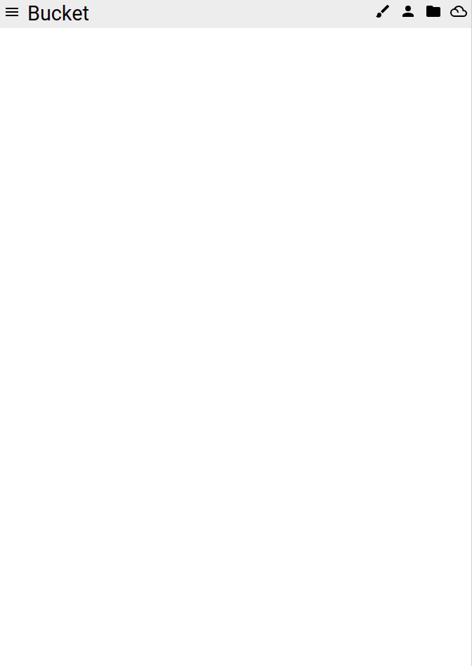

# Bucket

Check it out at <https://bucket-12.web.app>

Web app that allows the user to create and fill a 'paint-by-numbers' from an uploaded image. Made in vanilla JS/HTML/CSS, hosted on Firebase and served by a Google Cloud function for the conversion.

There is also the ability to save and share images with other users, and use their creations as jumping off points for your own.

## Libraries

Thanks to the jscolor team, David DeSandro for his Masonry library and the OpenCV project.

## Licensing

Licensed under the GPL v3.
